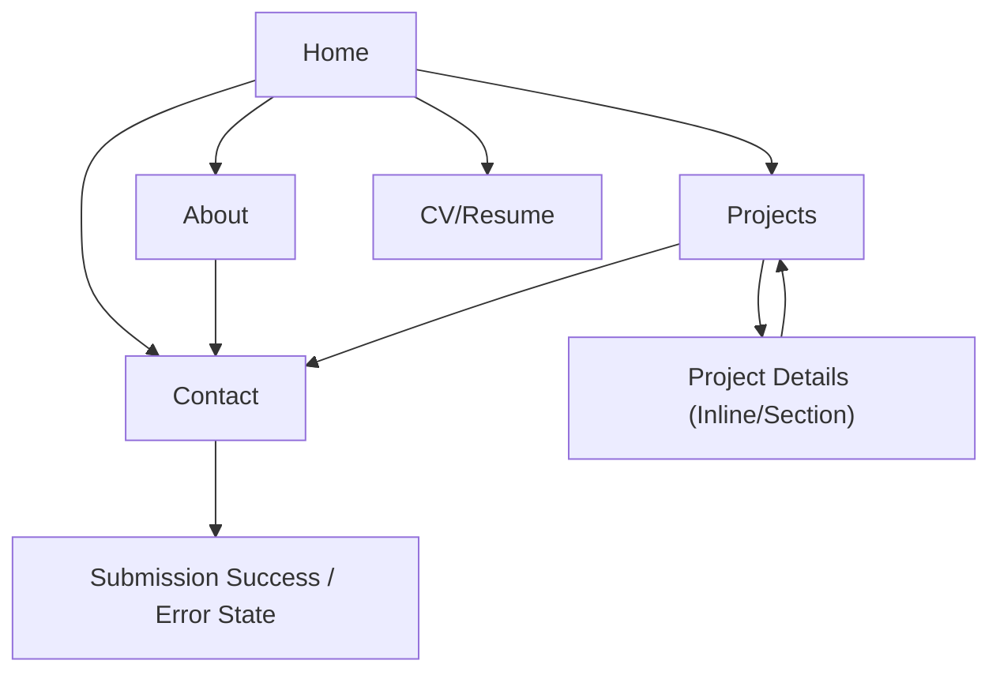

## 1. Product Overview
A responsive personal portfolio website to present your work, story, and ways to contact you.
It helps recruiters/clients quickly assess projects and reach you.

## 2. Core Features

### 2.1 Feature Module
Our portfolio requirements consist of the following main pages:
1. **Home**: hero intro, primary navigation, featured projects, key links/CTAs.
2. **Projects**: projects list with filters/tags, project detail view (inline or dedicated section), outbound links.
3. **About**: bio, skills/stack, experience highlights, downloadable CV link.
4. **CV/Resume**: dedicated resume page with experience, skills, and downloadable PDF.
5. **Contact**: contact form, social links, submission confirmation/error states.

Cross-cutting:
- **Social profiles**: show GitHub/LinkedIn/etc. links in both header and footer.

### 2.3 Page Details
| Page Name | Module Name | Feature description |
|-----------|-------------|---------------------|
| Home | Header & Navigation | Show site title/logo and links to Home/Projects/About/Contact; support sticky header on scroll. |
| Home | Hero Intro | Present name, role tagline, short summary, and primary CTA to Projects/Contact. |
| Home | Featured Projects | Display 3–6 highlighted projects with thumbnail, title, short description, and link to details. |
| Projects | Project Catalog | List projects with cards; filter by tag/tech; support search by title/keyword. |
| Projects | Project Details | Show full description, tech stack, screenshots, responsibilities, and links (demo/repo). |
| About | Bio & Highlights | Present longer bio, interests, and concise timeline/experience highlights. |
| About | Skills | Show skills grouped (e.g., Frontend/Backend/Tools) with proficiency labels. |
| About | CV Download | Provide a downloadable CV/resume link and optional external profile links. |
| CV/Resume | Resume Content | Present education/experience timeline, skills, certifications, and key achievements. |
| CV/Resume | Resume Download | Provide a downloadable resume PDF link and print-friendly styling. |
| Contact | Contact Form | Collect name, email, and message; validate inputs; prevent accidental double-submit; submit and show success/failure message. |
| Contact | Contact Links | Provide email link and social/profile links (GitHub, LinkedIn, etc.). |

## 3. Core Process
- Visitor Flow: Open Home → skim hero/featured projects → go to Projects for deeper review → go to About for background → submit Contact form.
- Contact Submission Flow: Fill form → client-side validation → submit → show success confirmation (or error with retry).

