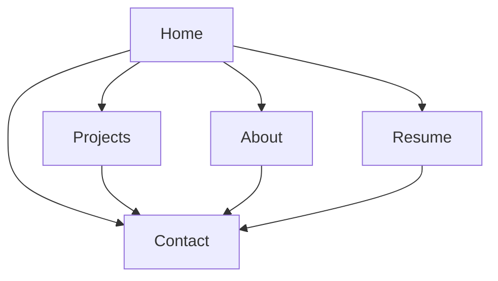

## 1. Product Overview
Extend the existing portfolio site to better position you as an **AI Engineer**, while preserving the current dark, minimal, high-contrast style.
Enhance the **3D hero / intro animation** to feel more premium, performant, and accessible.

## 2. Core Features

### 2.1 Feature Module
The portfolio consists of the following essential pages:
1. **Home**: AI Engineer headline/copy, enhanced 3D hero + intro overlay, featured projects, quick actions.
2. **Projects**: AI-focused project list, project details panel, tags/highlights.
3. **About**: long-form AI Engineer narrative, skills grouped around AI/LLMs + engineering.
4. **Resume**: AI Engineer resume summary, experience/education sections, print/save CTA.
5. **Contact**: direct contact methods and social links.

### 2.2 Page Details
| Page Name | Module Name | Feature description |
|---|---|---|
| Home | Enhanced 3D hero | Render a 3D scene that reinforces “AI Engineer” identity; animate camera/object smoothly; keep subtle blue accent lighting; keep layout consistent with current grid hero. |
| Home | Intro overlay (enhanced) | Play a short premium intro on first session only; allow “Enter/Skip”; respect reduced-motion preference and instantly skip when enabled. |
| Home | AI positioning copy | Show updated role/title, updated short “about” copy, and updated “What I do” bullets aligned to AI engineering work (LLM apps, RAG, data pipelines, productionization). |
| Home | Featured projects | Display top projects with AI-forward summaries/tags; keep existing cards and navigation to Projects. |
| Projects | Project discovery | Browse projects; filter mentally via tags (no new UI required beyond existing tag display); keep current detail panel behavior. |
| Projects | AI case-study framing | Emphasize problem → approach → impact in each project’s description/highlights (copy-only). |
| About | Narrative + skills | Present a clear AI Engineer profile: what you build, what you optimize, and how you ship; update skills categories to include AI/ML/LLM stack (copy-only). |
| Resume | Resume content | Update resume summary and bullet wording to reflect AI engineering outcomes; preserve print/save behavior and layout. |
| Contact | Contact CTAs | Provide email + social links; keep current styling and accessibility. |

## 3. Core Process
**Visitor flow**
1. Visitor lands on Home.
2. If first visit in this browser session, an intro overlay plays (or is skipped immediately for reduced motion).
3. Visitor scans AI Engineer headline, 3D hero, and featured projects.
4. Visitor navigates to Projects for details, or About/Resume to validate experience.
5. Visitor uses Contact to reach out.

