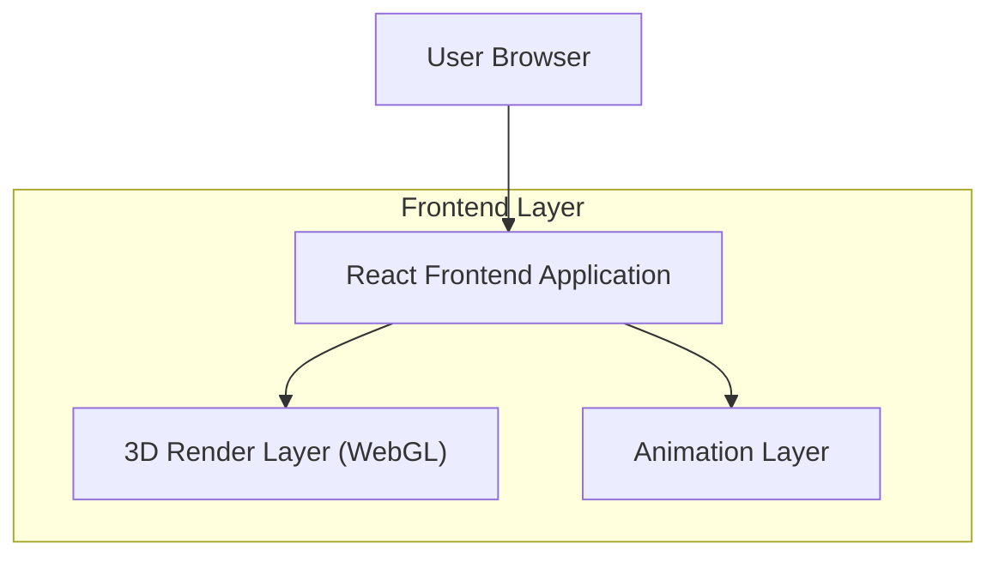

## 1.Architecture design

## 2.Technology Description
- Frontend: React@18 + TypeScript + vite + tailwindcss
- 3D: three + @react-three/fiber + @react-three/drei (GLTF model loading, OrbitControls, performance helpers)
- Animation: framer-motion (intro overlay + small entrance transitions)
- Backend: None

## 3.Route definitions
| Route | Purpose |
|-------|---------|
| / | Home page with intro + 3D hero + CTAs |
| /projects | Project listing/detail interactions |
| /resume | Resume content |
| /about | About content |
| /contact | Contact content |

## 4.API definitions (If it includes backend services)
N/A (no backend).

## 6.Data model(if applicable)
N/A (no database).

### Implementation notes (non-functional requirements)
- Bundle splitting: lazy-load the 3D scene (dynamic import) after initial paint; keep CTAs and text in the main bundle.
- Loading strategy: ship a poster image; progressively enhance to 3D once model + shaders are ready.
- Motion accessibility: use `prefers-reduced-motion` to skip intro and disable continuous rotation.
- Performance: limit DPR on mobile, cap frame loop (`frameloop="demand"` where possible), pause rendering when canvas is offscreen (IntersectionObserver).
- Compatibility: detect WebGL support; if unsupported, render static hero image.
- Assets: store the GLTF/GLB model under `public/` (or `src/assets/` if bundling is preferred) and ensure it is optimized (compressed textures, reasonable poly count).