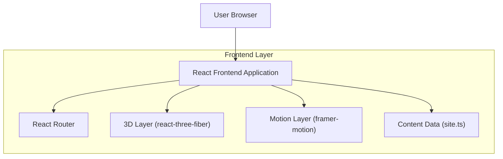

## 1.Architecture design

## 2.Technology Description
- Frontend: React@18 + TypeScript + react-router-dom@7 + tailwindcss@3 + vite
- 3D/Animation: three + @react-three/fiber + @react-three/drei + framer-motion
- Backend: None (static portfolio)

## 3.Route definitions
| Route | Purpose |
|---|---|
| / | Home page: enhanced 3D hero/intro overlay, AI Engineer positioning, featured projects |
| /projects | Projects list + project detail panel |
| /about | About narrative + skills |
| /resume | Resume content + print/save CTA |
| /contact | Contact CTAs + social links |
| * | Not found page |

## 4.API definitions (If it includes backend services)
None.

## 6.Data model(if applicable)
No database. Portfolio content is stored as static structured data (e.g., the existing `src/data/site.ts`).
