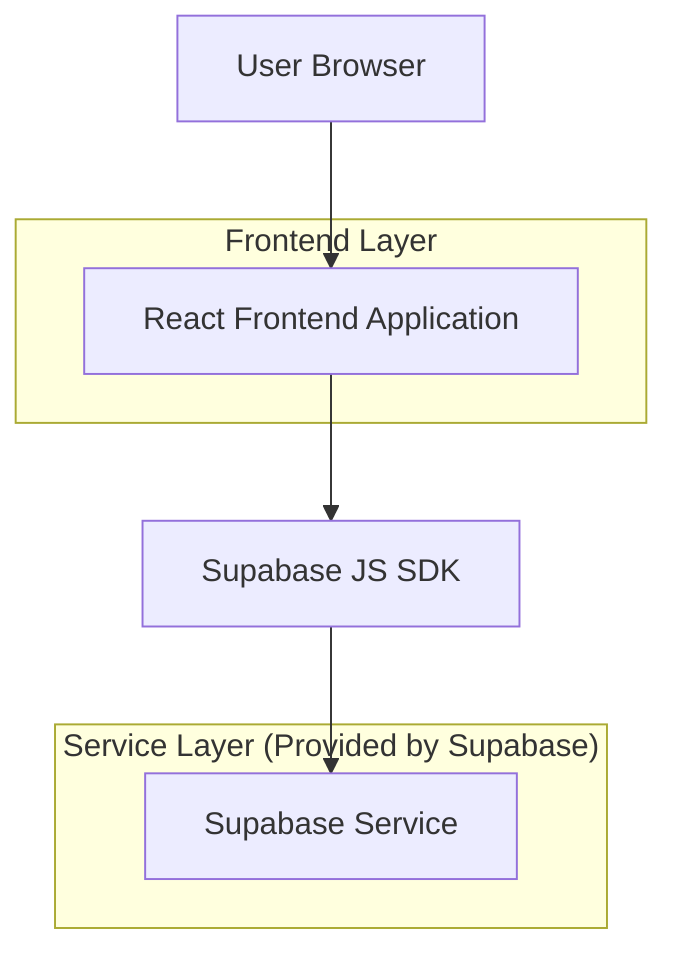
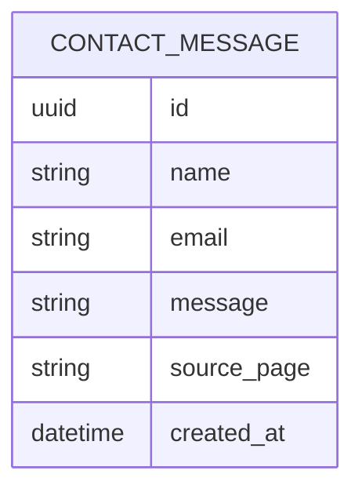

## 1.Architecture design


## 2.Technology Description
- Frontend: React@18 + vite + React Router + tailwindcss@3
- Backend (optional): Supabase (PostgreSQL for contact submissions)

## 3.Route definitions
| Route | Purpose |
|-------|---------|
| / | Home page with hero + featured projects |
| /projects | Projects list + project detail section/modal |
| /about | About page with bio, skills, CV link |
| /resume | CV/Resume page with printable layout + PDF download |
| /contact | Contact form + social/contact links |

## 4.Configuration
- Social profile links are defined as a single shared list used by both header and footer.
- Contact form submission can be implemented as:
  - Frontend-only (mailto fallback + client-side validation), or
  - Supabase insert into `contact_messages` (recommended if you want stored messages).

## 6.Data model(if applicable)

### 6.1 Data model definition


### 6.2 Data Definition Language
Contact messages table (contact_messages)
```
-- create table
CREATE TABLE contact_messages (
  id UUID PRIMARY KEY DEFAULT gen_random_uuid(),
  name TEXT NOT NULL,
  email TEXT NOT NULL,
  message TEXT NOT NULL,
  source_page TEXT,
  created_at TIMESTAMP WITH TIME ZONE DEFAULT NOW()
);

-- recommended: enable RLS
ALTER TABLE contact_messages ENABLE ROW LEVEL SECURITY;

-- RLS policy: allow anyone to insert (for contact form)
CREATE POLICY "anon_can_insert_contact_messages"
ON contact_messages
FOR INSERT
TO anon
WITH CHECK (true);

-- RLS policy: block public reads; allow authenticated reads (for your own admin viewing later)
CREATE POLICY "authenticated_can_read_contact_messages"
ON contact_messages
FOR SELECT
TO authenticated
USING (true);

-- permissions (keep minimal)
GRANT INSERT ON contact_messages TO anon;
GRANT SELECT ON contact_messages TO authenticated;
GRANT ALL PRIVILEGES ON contact_messages TO authenticated;
```
